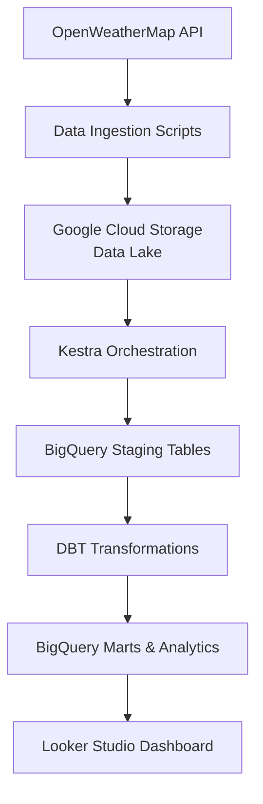

# DTC-AirQ-Project

Track the Global Air Quality Across Select Cities & Urban Health Impact

## Problem Statement

This project addresses the challenge of urban health monitoring by identifying high-risk air quality zones. It builds a comprehensive data pipeline to track PM2.5, PM10, and NO2 pollutant levels across major countries (Nigeria, UK, USA and India), That can enable city planners to pinpoint days of the week or locations that consistently exceed safety limits.

The solution involves:
- Getting air pollution data from OpenWeatherMap API.
- Creating a batch pipeline to process and store data in a data lake.
- Moving processed data to a data warehouse for analysis.
- Transforming data to prepare it for visualization.
- Building an interactive dashboard to display key insights.

## Architecture Overview

The project is fully developed in the cloud using Google Cloud Platform (GCP) with Infrastructure as Code (IaC) via Terraform. It employs a batch data pipeline orchestrated by Kestra, utilizing BigQuery as the data warehouse and DBT for transformations. The dashboard is built with Looker Studio for visualization.

### Architecture Diagram



1. **Data Ingestion:** Python scripts fetch air quality data (historical and current forecasts) and store raw JSON in Google Cloud Storage (data lake).
2. **Data Loading:** Raw data is loaded into BigQuery staging tables.
3. **Transformations:** DBT models clean, aggregate, and derive metrics for analytics.
4. **Dashboard:** Looker Studio connects to BigQuery to visualize trends and distributions.

### Project Structure

```
DTC-AirQ-Project/
├── InfraSetup/
│   └── terraform/
│       ├── main.tf
│       ├── service_account.json
│       ├── terraform.tfstate
│       ├── terraform.tfstate.backup
│       └── variables.tf
├── Ingestr/
│   ├── air_quality_current_forecast.py
│   └── air_quality_historical_backfill.py
├── Orchestration/
│   └── kestra-flows/
│       ├── docker-compose.yml
│       ├── Dockerfile
│       ├── README.md
│       └── Flows/
│           ├── air_quality_current_forecast.yaml
│           ├── air_quality_ingest_raw_bkfill.yaml
│           └── air_quality_ingest_raw.yaml
├── Transformtatn/
│   ├── run_dbt_pipeline.py
│   ├── run_dbt_pipeline.sh
│   ├── air_quality_dbt/
│   │   ├── dbt_project.yml
│   │   ├── profiles.yml
│   │   ├── README.md
│   │   ├── logs/
│   │   ├── models/
│   │   │   ├── sources.yml
│   │   │   ├── intermediate/
│   │   │   │   ├── int_air_quality_daily_summary.sql
│   │   │   │   └── int_air_quality_unified.sql
│   │   │   ├── marts/
│   │   │   │   ├── air_quality/
│   │   │   │   │   ├── fct_air_quality_measurements.sql
│   │   │   │   │   └── fct_daily_air_quality_summary.sql
│   │   │   │   └── analytics/
│   │   │   │       ├── city_air_quality_rankings.sql
│   │   │   │       ├── forecast_accuracy_analysis.sql
│   │   │   │       └── temporal_air_quality_patterns.sql
│   │   │   └── staging/
│   │   │       ├── stg_air_quality_current.sql
│   │   │       ├── stg_air_quality_forecast.sql
│   │   │       └── stg_air_quality_historical.sql
│   │   └── target/
│   │       ├── graph_summary.json
│   │       ├── graph.gpickle
│   │       ├── manifest.json
│   │       ├── partial_parse.msgpack
│   │       ├── run_results.json
│   │       ├── semantic_manifest.json
│   │       └── compiled/
│   │           └── air_quality_dbt/
│   │               └── models/
│   │                   ├── intermediate/
│   │                   ├── marts/
│   │                   └── staging/
│   ├── logs/
│   └── tests/
│       └── data_quality_tests.sql
├── Dashboard/
│   ├── airquality_app.py
│   ├── requirements.txt
│   └── README.md
├── pyproject.toml
└── README.md
```

## Data Pipeline

### Batch Processing
Data is ingested in batches: daily for historical data and hourly for current forecasts. This approach suits periodic updates rather than real-time streaming.

### Workflow Orchestration
Kestra manages the end-to-end pipeline, including ingestion, loading, transformation steps, and daily trigger. Flows are defined in YAML files under `Orchestration/kestra-flows/`.

### Data Warehouse
BigQuery tables are optimized with date partitioning and city clustering to support efficient queries. Staging tables hold raw data, while marts provide aggregated facts and analytics tables offer insights like city rankings and forecast accuracy.

### Transformations
DBT is used for all data transformations, from staging to marts and analytics. Models include data quality checks, aggregations, and derived metrics such as AQI categories and pollution load indices.

## Dashboard

The dashboard is built with Looker Studio, a free BI tool from Google that connects directly to BigQuery for real-time data visualization. It includes at least two tiles as required:

- **Temporal Distribution:** Line chart showing AQI trends over time by city (e.g., daily average AQI from `fct_daily_air_quality_summary`).
- **Categorical Distribution:** Bar chart ranking cities by average AQI (from `city_air_quality_rankings`).

### Dataset Details
- **Source:** Air quality data from OpenWeatherMap API, covering PM2.5, PM10, NO2, O3, SO2, CO, NH3 levels.
- **Coverage:** 2 Major cities in Nigeria, UK, USA, and India.
- **Tables Used:**
  - `fct_daily_air_quality_summary`: Daily aggregated metrics.
  - `fct_air_quality_measurements`: Granular measurements.
  - `city_air_quality_rankings`: Monthly city rankings.
  - `forecast_accuracy_analysis`: Forecast vs. actual comparisons.

### Dashboard Access
- **Looker Studio URL:** **[View Dashboard](https://lookerstudio.google.com/reporting/e789d418-64ba-49a6-ab3a-c87ad5a4d39f/)**
- **Suggestion:** For a more custom interactive dashboard, You can also use streamlit as a dashboard alternative. Run the Streamlit app in `Dashboard/` folder. Run app using command `streamlit run Dashboard/airquality_app.py`.

Additional visualizations include bubble maps for geographical AQI distribution, scatter plots for forecast accuracy, and heatmaps for hourly patterns.

## Technologies Used

- **Cloud:** Google Cloud Platform (GCP)
- **IaC:** Terraform
- **Orchestration:** Kestra
- **Data Warehouse:** BigQuery
- **Batch Processing:** Python with pandas
- **Transformations:** DBT
- **Dashboard:** Looker Studio (with Streamlit option for custom apps)

## Setup and Running Instructions

### Prerequisites
- Google Cloud account with BigQuery and GCS enabled.
- Terraform installed.
- Python 3.12+ with virtual environment.
- DBT installed.

### Infrastructure Setup
Navigate to `InfraSetup/terraform/` and run:
```bash
terraform init
terraform plan
terraform apply
```

### Data Pipeline Execution
1. Activate the virtual environment:
   ```bash
   & .venv\Scripts\Activate.ps1
   ```

2. Start Kestra via Docker Compose in `Orchestration/kestra-flows/`:
   ```bash
   docker-compose up -d
   ```

3. Run DBT transformations:
   ```bash
   cd Transformtatn/air_quality_dbt
   dbt run
   ```

### Dashboard Access
- Looker Studio: Connect to the BigQuery dataset and build reports.
- Streamlit: Run `streamlit run Dashboard/airquality_app.py` for the alternative dashboard.

## Contributing

Contributions are welcome via issues or pull requests.

## License

MIT License